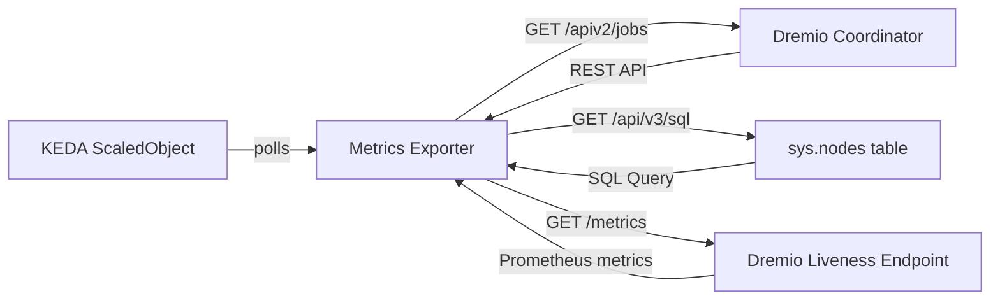

# Dremio KEDA Metrics Exporter

A metrics exporter for Dremio OSS that provides application-aware metrics for KEDA-driven autoscaling of Dremio executors.

## Overview

This exporter replaces the older autoscale/autostop CronJobs approach by providing real-time metrics that KEDA can use to scale Dremio executors based on actual workload demand.

### Architecture



### Components

- **DremioClient**: Thin REST client with token caching (1h TTL)
- **DremioLivenessClient**: Scrapes Prometheus metrics from Dremio liveness endpoint
- **K8sStateCollector**: Fetches current Deployment replica counts
- **DremioMetricsCollector**: Orchestrates all collectors and computes desired executor counts

### Scale Gate Logic

#### SMALL Tier (user + reflection jobs)
- `active_small_jobs > 0` or `reflection_jobs > 0` → hold at current
- Idle but within `SCALE_DOWN_GRACE_SECS` → hold at current (drain fragments)
- Idle past grace period → scale to 0

#### LARGE Tier (user jobs only)
- `active_large_jobs > 0` → hold at current
- Idle but within `SCALE_DOWN_GRACE_SECS` → hold at current
- Idle past grace period → scale to 0

## Metrics

| Metric | Description |
|--------|-------------|
| `active_user_jobs` | Running/queued jobs from human users |
| `active_small_jobs` | User jobs with `planner_estimated_cost <= threshold` |
| `active_large_jobs` | User jobs with `planner_estimated_cost > threshold` |
| `active_reflection_jobs` | Running jobs from system accounts (`$dremio$`, etc.) |
| `registered_executors` | Executors registered with Dremio coordinator |
| `executor_desired_small` | Desired Deployment replica count for small tier |
| `executor_desired_large` | Desired Deployment replica count for large tier |

## Configuration

| Environment Variable | Default | Description |
|----------------------|---------|-------------|
| `DREMIO_URL` | `http://dremio-coordinator-hs.dremio.svc.cluster.local:9047` | Dremio coordinator URL |
| `DREMIO_LIVENESS_URL` | `http://dremio-coordinator-liveness.dremio.svc.cluster.local:45679/metrics` | Liveness metrics endpoint |
| `DREMIO_USERNAME` | *required* | Dremio username with API access |
| `DREMIO_PASSWORD` | *required* | Dremio password |
| `MIN_EXECUTORS` | `0` | Minimum executor replicas |
| `MAX_EXECUTORS` | `4` | Maximum executor replicas |
| `SMALL_QUERY_THRESHOLD` | `10000000` | Cost threshold for small vs large jobs |
| `SCALE_DOWN_GRACE_SECS` | `120` | Grace period before scaling to 0 |
| `NAMESPACE` | `dremio` | Kubernetes namespace |

## Installation

### K8s Deployment Manifest

```yaml
apiVersion: apps/v1
kind: Deployment
metadata:
  name: dremio-metrics-exporter
  namespace: dremio
spec:
  replicas: 1
  selector:
    matchLabels:
      app: dremio-metrics-exporter
  template:
    metadata:
      labels:
        app: dremio-metrics-exporter
    spec:
      serviceAccountName: dremio-metrics-exporter
      imagePullSecrets:
        - name: ghcr-secret
      containers:
        - name: metrics-exporter
          image: ghcr.io/faenx/dremio-keda-exporter:2026.05.0
          imagePullPolicy: Always
          ports:
            - containerPort: 5001
          env:
            - name: DREMIO_URL
              value: "http://dremio-coordinator.dremio.svc.cluster.local:9047"
            - name: DREMIO_USERNAME
              valueFrom:
                secretKeyRef:
                  name: dremio-ops-credentials
                  key: DREMIO_USERNAME
            - name: DREMIO_PASSWORD
              valueFrom:
                secretKeyRef:
                  name: dremio-ops-credentials
                  key: DREMIO_PASSWORD
            - name: NAMESPACE
              value: "dremio"
```

### KEDA ScaledObject

```yaml
apiVersion: keda.sh/v1alpha1
kind: ScaledObject
metadata:
  name: dremio-executor-small
  namespace: dremio
spec:
  scaleTargetRef:
    name: dremio-executor-small
  triggers:
    - type: metrics-api
      metadata:
        url: http://dremio-metrics-exporter.dremio.svc.cluster.local:5001/json
        throughput: "1"
  minReplicaCount: 0
  maxReplicaCount: 2
```

## Development

### Run Tests

```bash
pip install -r requirements.txt
pytest test_app.py -v
```

### Linting

```bash
pip install flake8
flake8 . --config=.flake8
```

### Build Docker Image

```bash
docker build -t ghcr.io/faenx/dremio-keda-exporter:2026.05.0 .
docker push ghcr.io/faenx/dremio-keda-exporter:2026.05.0
```

## License

Apache License 2.0 - See [LICENSE](LICENSE) for details.

## Credits

- Original Dremio OSS codebase: [dremio-oss](https://github.com/dremio/dremio-oss)
- KEDA metrics-api scaler: [keda](https://keda.sh/)
